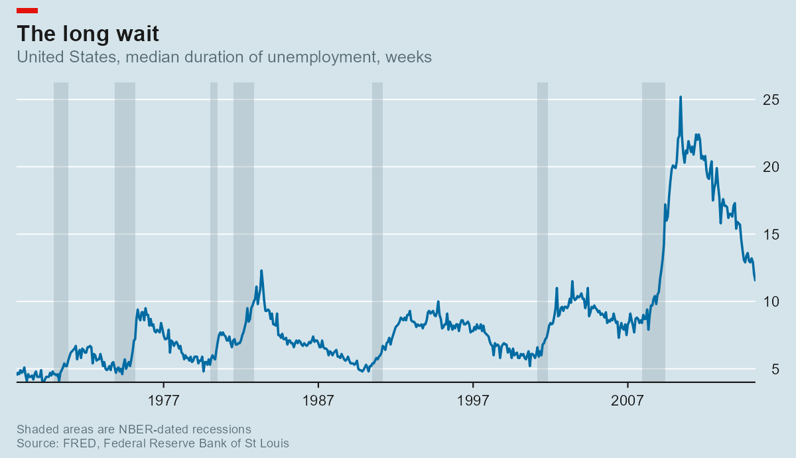
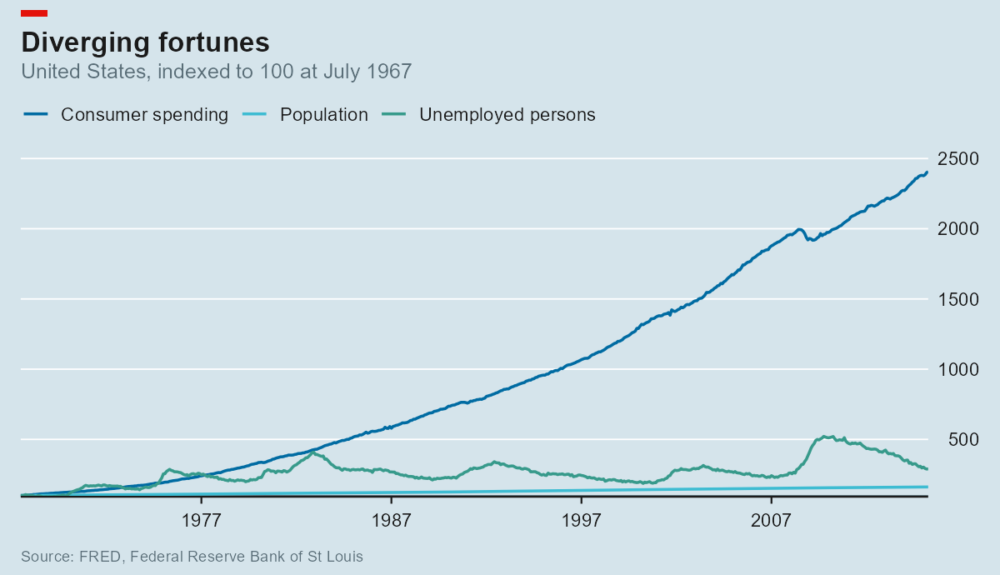
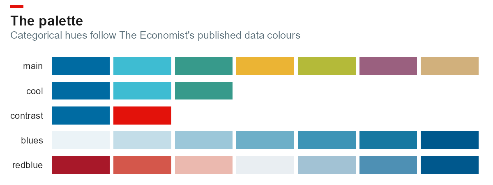

# fredscape

<!-- badges: start -->
[](https://github.com/mjorden/fredscape/actions/workflows/R-CMD-check.yaml)
[](https://lifecycle.r-lib.org/articles/stages.html#experimental)
[](LICENSE)
<!-- badges: end -->

Pull economic series from [FRED](https://fred.stlouisfed.org/) into tidy data
frames, and plot them in the house style of *The Economist* — without hand-
theming every chart.

Two halves that work on their own:

- **A FRED client.** `fred_series()`, `fred_series_info()` and `fred_search()`
  return plain data frames. One row per series per date, so a multi-series
  chart is one `ggplot()` call.
- **A chart style.** `theme_econ()`, `scale_colour_econ()`, `labs_econ()`,
  `annotate_recessions()` and `econ_masthead()` reproduce the printed chart
  furniture: blue-grey panel, horizontal gridlines only, right-hand y-axis,
  left-hung title, red masthead block.



## Installation

```r
# install.packages("remotes")
remotes::install_github("mjorden/fredscape")
```

## Getting a key

FRED needs a free API key. Request one at
[fredaccount.stlouisfed.org/apikeys](https://fredaccount.stlouisfed.org/apikeys),
then put it somewhere the package can find it:

```r
usethis::edit_r_environ()   # add: FRED_API_KEY=your32characterkey
```

The key is read from the `FRED_API_KEY` environment variable, so it never has
to appear in a script or a git history. `fred_set_key()` sets it for one
session; `fred_has_key()` reports whether one is available.

## Quick start

```r
library(fredscape)
library(ggplot2)

unrate <- fred_series("UNRATE", start = "1970-01-01")

head(unrate)
#>   series_id       date value
#> 1    UNRATE 1970-01-01   3.9
#> 2    UNRATE 1970-02-01   4.2
#> 3    UNRATE 1970-03-01   4.4

p <- ggplot(unrate, aes(date, value)) +
  annotate_recessions(from = min(unrate$date), to = max(unrate$date)) +
  geom_line(colour = econ_colours("blue"), linewidth = 0.8) +
  scale_x_econ_date() +
  scale_y_econ() +
  labs_econ(
    title    = "Out of work",
    subtitle = "United States, unemployment rate, %",
    note     = "Shaded areas are NBER-dated recessions",
    source   = "FRED, Federal Reserve Bank of St Louis"
  ) +
  theme_econ()

econ_masthead(p)
```

Several series at once, with FRED doing the transformation server-side:

```r
inflation <- fred_series(
  c("CPIAUCSL", "PCEPI"),
  start = "2015-01-01",
  units = "pc1"          # % change from a year ago
)

ggplot(inflation, aes(date, value, colour = series_id)) +
  geom_line(linewidth = 0.8) +
  scale_colour_econ() +
  scale_y_econ() +
  theme_econ()
```

Don't know the series ID? `fred_search("real median household income")`
returns titles, units, frequency and coverage for the matches.



## The palette



The categorical hues (`main`, `cool`, `contrast`) follow the data palette *The
Economist* publishes for its own charts. The sequential (`blues`) and diverging
(`redblue`) ramps are built from those hues rather than copied from a published
ramp — Economist-flavoured rather than Economist-official.

```r
econ_colours("red", "blue")
econ_pal("blues")(9)

scale_colour_econ()          # discrete
scale_fill_econ_c("redblue") # continuous, diverging
```

## What's in the box

| | |
|---|---|
| `fred_series()` | Observations for one or more series, tidy and stacked |
| `fred_series_info()` | Title, units, frequency, seasonal adjustment, coverage |
| `fred_search()` | Full-text search over the FRED catalogue |
| `fred_recessions()` | NBER turning points, read live from `USREC` |
| `fred_key()` / `fred_set_key()` / `fred_has_key()` | Key handling |
| `theme_econ()` | The theme. `panel = "blue"`, `"white"` or `"dark"` |
| `scale_y_econ()` / `scale_x_econ_date()` | Right-hand y labels, no x padding |
| `labs_econ()` | Title, subtitle, and a properly formatted source line |
| `scale_colour_econ()` and friends | Discrete and continuous colour scales |
| `annotate_recessions()` | Recession bands behind the data |
| `econ_masthead()` | The red block above the title |
| `nber_recessions` | Every NBER-dated US contraction since 1857 |

## Design notes

**The masthead is not a layer.** The red block sits above the title, outside
the plotting area, so it cannot be added with `+`. `econ_masthead()` converts
the plot to a grob table and inserts the block as a new row aligned to the
title's left edge. It therefore has to come last — the result is a grid object,
not a ggplot, and `ggsave()` still accepts it.

**Recession dates work offline.** `nber_recessions` is a bundled table of all
34 NBER-dated contractions from 1857 to 2020, so `annotate_recessions()` needs
no key and no network. `fred_recessions()` reads the same turning points live
from `USREC` when currency matters more than convenience — it collapses runs of
the 0/1 indicator back into peak/trough intervals.

**No font is assumed.** *The Economist* sets in a proprietary face (Officina
Sans / EconSans). `theme_econ(base_family = "")` uses the device default rather
than silently falling back from a font you don't have. Pass a family you
actually have installed to get closer.

**The key stays out of messages.** It travels as a query parameter, so it can
end up echoed in an API error. Error bodies are scrubbed of anything key-shaped
before they reach you, and a malformed key is rejected locally with a message
that reports its length, not its value.

## Testing

```bash
Rscript -e 'devtools::test()'
```

179 tests, no network required. The API parsers run against saved payloads in
`tests/testthat/fixtures/`; the argument validators are checked to fire before
any request is built; the recession logic is round-tripped through a
reconstructed `USREC` indicator.

The figures above are rendered by `data-raw/readme_figures.R` from ggplot2's
bundled `economics` data set — itself an extract of five FRED series — so the
README can be rebuilt with no key and no network.

## Sources and attribution

Series data comes from the Federal Reserve Bank of St Louis. FRED is a
registered trademark of the Federal Reserve Bank of St Louis; this package is
not affiliated with or endorsed by it, and neither is *The Economist*. Check
the terms of the underlying source before redistributing any series —
`fred_series_info()$notes` usually names it.

Recession dates: National Bureau of Economic Research,
[US Business Cycle Expansions and Contractions](https://www.nber.org/research/data/us-business-cycle-expansions-and-contractions).

## License

MIT © Matthew Jorden
